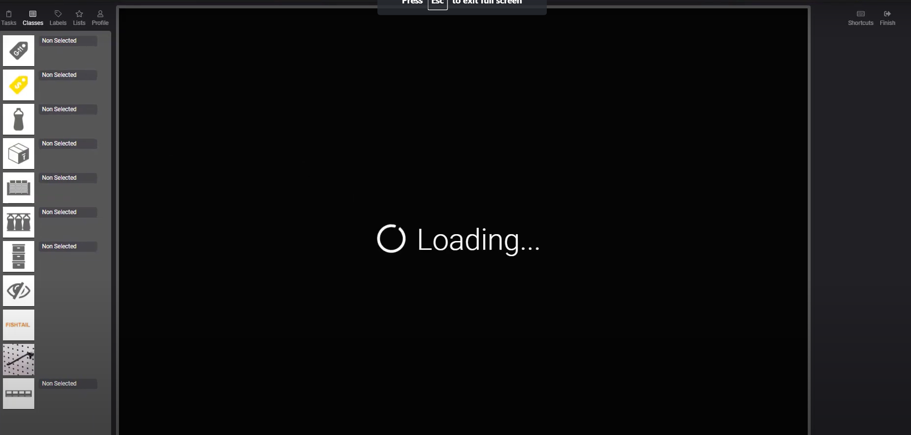

# About
Paypertag is a tool that helps annotators to calculate their estimate earnings based on tag drawn. Those who work in image annotation companies would be best for them.
# Video intro

Note: The the tool is supportive in the nature of https://www.imageannotation.ai/
# Front

# Image annotation tool 

